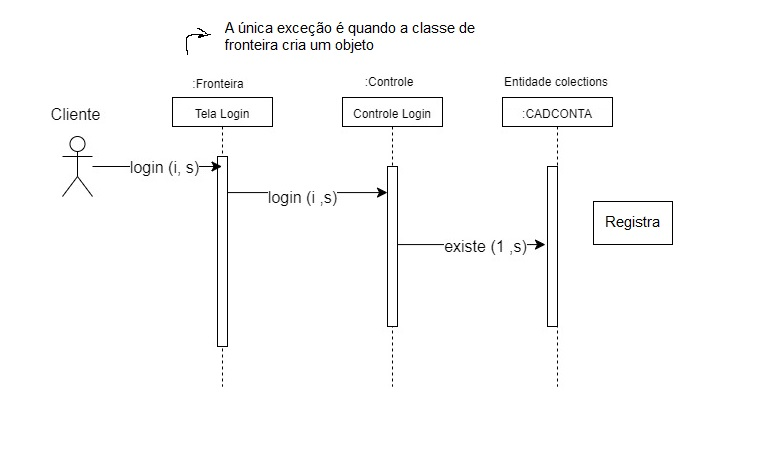
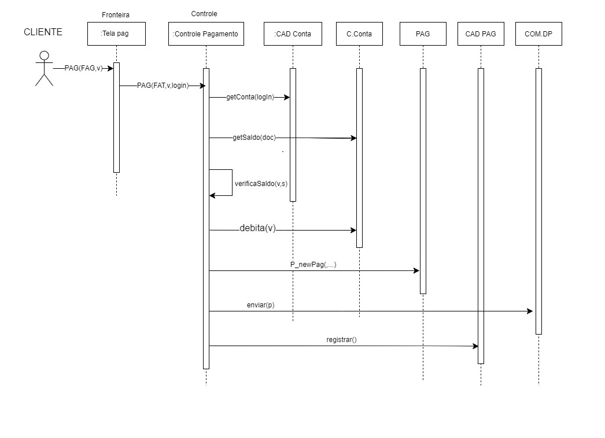

# if718_AnaliseEProjetoDeSistemas

https://sites.google.com/a/cin.ufpe.br/if718/home

====================

- A vantagem de ter mais de um nível de camada é fácil de empacotar um subsistema

===================

O método que está indicando para a classe pertence a mesma
